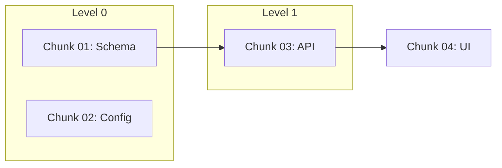

# Create Implementation Plan

## The Plan Model

- **Plan** = a DAG. Nodes are **chunks**; edges are dependencies between chunks.
- **Chunk** = one DAG node: a coherent unit of work made of an **ordered list of tasks**. The unit of parallelism.
- **Task** = smallest unit, inside a chunk, run **strictly in sequence** (T2 starts after T1 finishes).
- **DAG level** = chunks whose dependencies are all satisfied at that depth. Same-level chunks run **in parallel**. Levels are derived from edges, not assigned.

## Principles

**The plan is the agent's entire world.** Every task must be self-contained: an engineer picking it up cold has everything needed, no tribal knowledge, no implicit assumptions.

**Plan, don't implement.** Tell the implementing agent *what* and *why*, not the code. A spec reads like a senior engineer briefing a capable teammate — clear on intent, scope, files, contracts; silent on line-by-line implementation. If you're writing the solution, stop.

**Code in plans — describe, don't write.** No code for CRUD/controllers/services/entities/boilerplate/config/components/standard patterns — the implementer derives those from the contract + conventions. A 3–10 line snippet is allowed *only* for genuinely subtle logic (a tricky calculation, a non-obvious regex) where prose would be ambiguous. Test before any code block: *could a competent engineer write this from the prose + contract?* If yes, delete it.

**Contracts are declarations, not code.** State the shape — `transactions (id UUID PK, amount DECIMAL(12,2), date DATE)` or `getSpendingByCategory(start, end) → {categoryId, total, percentage}[]` — never an entity class or full endpoint.

## Inputs

- **Scope description** — ticket body, narrative, or requirements.
- **Codebase context** — structure, stack, patterns, layout (provided or discovered).
- **CLAUDE.md** — conventions and standards, assumed at repo root.

If any are missing, ask before proceeding. Don't guess at conventions.

## Workflow

Gated, multi-phase. Two hard stops where you yield and wait. A 🛑 **STOP** = finish the current artifact, tell the user exactly what you need, end your turn. Never proceed past a STOP on your own. No preamble or phase narration in any phase — not just human-facing ones. Internal phases (3, 6) produce only the artifact or the edits; no explanation of what you did or why.

```
0  Set up plan folder
1  Understand → questions.md → 🛑 wait for answers
2  Summary: problem (<200w) + solution (<200w) → 🛑 wait for approval
3  Draft the detailed solution
4  Decompose into chunks (DAG nodes; walking-skeleton first, risk-first), each an ordered task list
5  Per-chunk file with task sequence + tests/validation
6  Per-chunk YAGNI reduction pass
7  Write index plan.md (with Mermaid DAG) and hand off
```

### Phase 0 — Plan Folder

Create `.plans/plan-<key>/`. `<key>` is the ticket key (e.g. `MOD-123`), used verbatim. No key → derive a slug from the feature name (e.g. `plan-personal-finance-dashboard`). All artifacts live here.

### Phase 1 — Understand (→ questions.md → STOP)

Understand the problem and goal before anything else. Don't paper over ambiguity with assumptions — surface it as questions. Work through: the real goal (the *why*, not just the literal feature); system boundaries (DB/API/UI/infra); what exists vs. what's new; what's genuinely unclear enough to misdirect the plan.

Write `questions.md`, grouped by theme. Each question gets a best-guess default so the user can confirm fast. Only include questions that change the plan. Never write "I assume X" — make it a question. Always include a question about validation commands.

```markdown
# Clarifying Questions: [Feature Name]

> Answer inline under each question, then tell me to continue.
> If my default is fine, write "default" or "yes".

## [Theme]
### Q1: [Question]
**Options:** [if applicable]
**Why it matters:** [one line — what changes depending on the answer]
**My default:** [best guess / recommendation]
**Answer:**

## Commands
### Q[n]: What are the standard validation commands for this project?
**Why it matters:** Chunk validation commands are pulled from these; invented commands break at execution time.
**My default:** npm test / npx tsc --noEmit / npm run lint
**Answer:**
```

🛑 **STOP.** Tell the user the questions are at `.plans/plan-<key>/questions.md`; ask them to answer inline and say when to continue. Wait.

### Phase 2 — Confirm Understanding (→ summary → STOP)

Synthesize the answers and present a tight alignment check (optionally save as `summary.md`):
- **Problem** — what we're solving and the goal (2–4 sentences)
- **Intended solution** — approach, architecture sketch, key decisions, in/out of scope
- **Key decisions locked** from the Q&A
- **Explicit non-goals**

🛑 **STOP.** Ask: "Does this match your intent? Approve, or give feedback and I'll revise." Wait. Don't start planning detail until approved.

### Phase 3 — Draft the Solution

Draft end-to-end in ≤300 words: architecture, components, data flow, sequence. This is internal working memory — not written to disk. Move to Phase 4 once the approach is clear; don't expand until it's right.

### Phase 4 — Decompose into Chunks

**4a — Chunks (nodes):**
- **Walking skeleton first** — the thinnest end-to-end slice that proves the architecture and delivers something real is the DAG spine; everything else hangs off it. (E.g. schema chunk → API chunk → chart-UI chunk. Not the skeleton: seed data, error handling, responsive layout, filtering.)
- **Coherent + independently shippable** — groups related work (a layer, vertical slice, subsystem) into a testable increment. Unrelated, unordered pieces go in separate chunks so they parallelize.
- **Risk-first** — place high-risk/high-uncertainty chunks as early as dependencies allow, so failure is cheap.
- **Explicit, acyclic deps** — a chunk depends on another only if it needs that chunk's output (contract). No cycles.
- **Maximize parallelism** — fan out from foundation chunks; don't couple chunks that only feel related.
- **Size** — ~2–6 tasks. Single-task chunk → probably a task in a neighbor. >8 tasks → split into dependent chunks.

**4b — Tasks (the sequence):** ordered T1 → T2 → T3, each assuming the prior done; ~5–10 min each, one committable step. Same-chunk tasks may freely build on each other. Cross-chunk needs go through the upstream **contract**, never another chunk's internal task detail.

**4c — Contracts:** for any chunk a downstream chunk consumes, declare the produced shape (columns+types, request/response fields, signature, props) compactly. Lets downstream build against it before the upstream is done.

Levels are derived: level 0 = no deps; level N = deps all in <N. Record them in plan.md.

### Phase 5 — Per-Chunk Files

One file per chunk: `chunk-<seq>-plan-<key>.md` (seq = level, then risk within level). Must follow the template; must be **mechanically validatable** (a runnable check that passes/fails without human judgment).

```markdown
# Chunk <seq>: [Name]
**Plan:** plan-<key>   **DAG level:** <n>   **Risk:** High | Medium | Low

## Goal
[2–3 sentences: what this delivers and the increment it adds.]

## Depends On (chunks)
- [chunk-<seq> — which contract of it this needs] (or: none — level 0)

## Scope
**In:** [...]   **Out:** [...pushed to which later chunk]

## Tasks (in sequence)
1. **T1: [name]** — [what to do: files, patterns, conventions. Prose, not code.]
2. **T2: [name]** — [...] (assumes T1 done)

## Files
- [path] — [what changes, which task]

## Output Contract
[Shape for downstream chunks — field list / signature / props. Omit if nothing consumes it.]

## Acceptance Criteria
- [ ] [specific, testable]

## Tests & Validation
**Test cases:**
- [ ] [input/condition → expected]
**Validation command(s):**
`[use only commands confirmed in Phase 1 Q&A — do not invent commands]`

## Execution State
- **status**: Not Started
- **tasks_completed**: [agent-updated]
- **log**: [agent-updated]
- **files_modified**: [agent-updated]
```

### Phase 6 — YAGNI Reduction Pass

No narration; edits only. Per chunk, cut to the minimal version that meets the goal. Edit in place; collapse or delete tasks.

Bias: delete before adding; prefer stdlib and platform features over new code; one line over a function; minimum viable over complete. No unrequested abstractions, no avoidable dependency, no boilerplate nobody asked for. When two stdlib options are equal size, pick the edge-case-correct one.

**Not lazy about:** input validation at trust boundaries, error handling that prevents data loss, security, accessibility, anything explicitly requested. Keep the Tests & Validation section — that's the floor. Record deliberate shortcuts with a `ponytail:` note naming the ceiling + upgrade path (e.g. O(n²) scan, global lock).

### Phase 7 — Index plan.md + Hand Off

Write `plan.md` as a map over the chunks (not a duplicate of detail). MUST include a Mermaid DAG.

````markdown
# Plan: [Feature Name]
**Key:** <key>   **Folder:** .plans/plan-<key>/

## Problem & Goal
[2–4 sentences from the approved summary.]

## Solution Summary
[Brief approach + non-goals.]

## DAG


## Walking Skeleton
chunk-01 → chunk-03 → chunk-04 (thinnest working slice)

## Chunk Overview
| Chunk | Name | Depends On | Level | Risk | Tasks | File |
|-------|------|-----------|-------|------|-------|------|
| 01 | [name] | — | 0 | High | 3 | chunk-01-plan-<key>.md |

## Parallel Rounds
- **Level 0** (01, 02): [one line]
- **Level 1** (03): [one line]
- **Level 2** (04): [one line]

## Decision Log
[Locked decisions from Q&A and summary — agent and human.]
````

Tell the user the plan is ready, where it lives, and that they can review chunk files before running `/maf-se-run-graph-plan` to execute it.

## Quality Checklist (verify before handing off)

1. **Gates respected** — questions answered and summary approved before any chunk written. Never skip a STOP.
2. **DAG valid** — no orphan chunks, no cycles; every dep listed and resolvable.
3. **Walking skeleton valid** — the chunk critical path is a working end-to-end slice.
4. **Contracts complete** — every depended-on chunk has an output contract (shape, not source); downstream consume contracts, not internal tasks.
5. **Tasks sequenced + self-contained** — ordered, each implementable given prior tasks in the chunk.
6. **Risk-first, sized (2–6 tasks/chunk, ~5–10 min/task), YAGNI reduced, mechanically validatable.**
7. **Minimal code** — most chunks have zero code blocks; each surviving block passes the "Code in Plans" test.
8. **plan.md has a Mermaid DAG.**